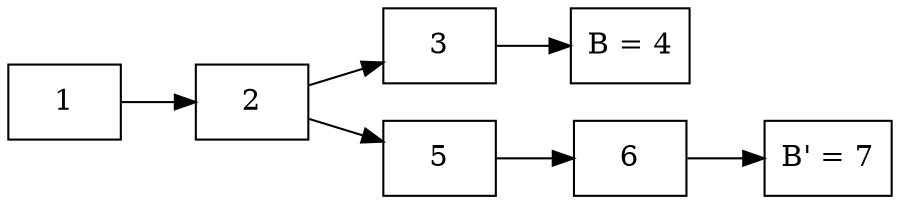
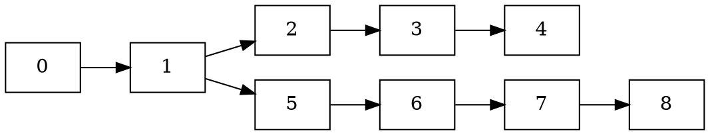
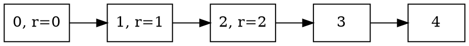
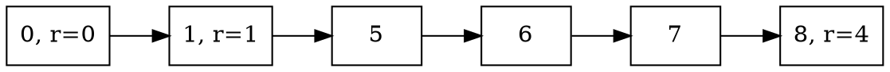

# Chapter 1

## Accountable Safety for GRANDPA

Accountable Safety for GRANDPA is a synchronous interactive protocol for
tracking down and proving after the fact when participants misbehave. The idea
is that even is more than 1/3 of participants misbehave and finalize
conflicting forks, they will not get away with and will get their stake
slashed.

In the [GRANDPA
paper](https://github.com/w3f/consensus/blob/master/pdf/grandpa.pdf) there is a
proof by construction for showing that if two blocks B and B' for which valid
commit messages were sent, but do not lay on the same chain, then there are at
least f + 1 Byzantine voters. The proof itself then provides the procedure for
tracking down this set of misbehaving voters.

## Definitions

We refer to the GRANDPA paper for in-depth material, it is still useful to
restate a some of the more important definitions here.

### GHOST Function

The function $g(S)$ takes the set of votes and returns the block B with the
highest block number such that S has a supermajority for B.

### Estimate

$E_{r,v}$ is voter v's estimate of what might have been finalized in round
r, given by the last block in the chain with head $g(V_{r,v})$ for which it
is possible for $C_{r,v}$ to have a supermajority.

### Completable

Denote descendent blocks by $B < B'$, where block B' is a descendent of
block B. Then if either $E_{r,v} < g(V_{r,v})$ or it is impossible for
$C_{r,v}$ to have a supermajority for any children of $g(V_{r,v})$,
then we say that v sees that round r as completable. In other words, when
$E_{r,v}$ contains everything that could have been finalized in round r.

$E_{r,v}$ having supermajority means that $E_{r,v} < g(V_{r,v})$.

## Outline of the Procedure

With these definitions we can begin outlining the procedure to track down
equivocating voters.

### Step 0.

The first step is detecting blocks B and B' on two different branches being
finalized. If these two blocks were finalized in the same round, we can take
the union of the set of precommits to quickly find the equivocators. So let's
assume that B' was finalized in a later round r' than B, which was finalized in
round r. That is, r'> r.

This occurs when a node detects commit messages for mutually conflicting
blocks. At this point they trigger the accountable safety protocol.

### Step 1. Start asking questions about B'

When we have two blocks that are finalized on conflicting branches, we
naturally ask ourselves, when the latter block was voted for, why wasn't the
former into taken into account? More precisely, when finalizing B' in round r',
why didn't the estimate for the preceeding round include B. Recall that the
estimate for the previous round includes all blocks that could possible be
finalized in that round.

For this step we assume that r' > r + 1, that is, there are at least a two
rounds separation between finalizing B and B'. Should r' = r + 1, we can skip
to step 2 below.

We send out requests to all voters in the commit for B', asking:

> _Why did the estimate for the preceeding round not include B when prevoting
> or precommitting for B'?_

A valid answer is a set S of entirely either of prevotes or precommits for the
preceeding round r'-1, such that it's impossible for S to have a supermajority
for B.

Since the estimate is defined in terms of both prevotes and precommits,
prevotes indirectly through the GHOST function, and precommits directly, we
accept answers containing either of these, but not a mix.

The point of these questions is that we can successively step backwards round
by round until we reach round r+1, which is the round after the first block B
was finalized.

We don't need every voter to reply, as long as we have a single reply
containing the voter set S we can make progress. Only in the case when we get
no replies at all do we consider the non-responders as Byzantine.

We keep sending out requests asking why the estimate in each round didn't
include B, until we get a reply for the estimate of round r+1.

### Step 2. Reach the round after which B was finalized

Once we get a reply containing votes S for the round r+1, we reach a point
where we can start to get closure.

At this point, when we are in round r+1, our request for estimate of the
preceding round will now be be answered with a set of votes that are from the
same round as the first block B was finalized in.

If the reply is in the form of a set S of precommits, we can take the union
with the precommits in the commits message for B to find equivocators. With
this we can terminate the protocol as we've found a set of Byzantine voters.
Not necessarily all of them, but more than the threshold for when Byzantine
consensus can be subverted.

Now if for this step, if the reply to the request is instead a set S of
prevotes, we need to take one additional step before we can home in on the
equivocators.

### Step 3. Instead ask the precommitters for B

To be able to find the equivocators we need something to compare the reply from step 2 against. As such, we send a request to all voters in the commit for block B, asking:

> _What prevotes have you seen for round r?_

A valid reply is a set T of prevotes with a supermajority for B. With this we
can now take the union between T and S to find the equivocators.

## Example

Consider the set of voters
$$V =\lbrace\text{Alice}, \text{Bob}, \text{Carol}, \text{Dave}\rbrace.$$
Let's assume Alice and Bob are Byzantine voters and manage to partition the
network, dividing the voter set into two
$$V_1 =\lbrace\text{Alice}, \text{Bob}, \text{Carol} \rbrace,$$
$$V_2 =\lbrace\text{Alice}, \text{Bob}, \text{Dave} \rbrace.$$
Since number number of Byzantine voters is above the threshold for BFT safety,
a possible scenario is that they can collude to force finalization on two
different forks,

where $V_1$ finalizes

and $V_2$ finalizes

Note that $V_2$ does not necessarily finalize anything on round 2 and 3.

Lets exemplify this with votes that could lead to this is. First we have the votes before the partition

$$
\text{Round 0}, V:
\begin{cases}
\text{Prevotes} = \lbrace \text{Alice} = 1, \text{Bob} = 1, \text{Carol} = 1, \text{Dave} = 1 \rbrace,\\\\
\text{Precommits} = \lbrace \text{Alice} = 1, \text{Bob} = 1, \text{Carol} = 1, \text{Dave} = 1 \rbrace,
\end{cases}
$$

Then for the first partition, $V_1$,
$$
\text{Round 1}, V_1:
\begin{cases}
\text{Prevotes} = \lbrace \text{Alice} = 4, \text{Bob} = 4, \text{Carol} = 2 \rbrace, \\\\
\text{Precommits} = \lbrace \text{Alice} = 2, \text{Bob} = 2, \text{Carol} = 2 \rbrace,
\end{cases}
$$

and similarly for the second parition $V_2$

$$
\text{Round 1}, V_2:
\begin{cases}
\text{Prevotes} = \lbrace \text{Alice} = 1, \text{Bob} = 1, \text{Dave} = 5 \rbrace, \\\\
\text{Precommits} = \lbrace \text{Alice} = 1, \text{Bob} = 1, \text{Dave} = 1 \rbrace,
\end{cases}
$$

$$
\text{Round 2}, V_2:
\begin{cases}
\text{Prevotes} = \lbrace \text{Alice} = 1, \text{Bob} = 1, \text{Dave} = 5 \rbrace, \\\\
\text{Precommits} = \lbrace \text{Alice} = 1, \text{Bob} = 1, \text{Dave} = 1 \rbrace,
\end{cases}
$$

$$
\text{Round 3}, V_2:
\begin{cases}
\text{Prevotes} = \lbrace \text{Alice} = 8, \text{Bob} = 8, \text{Dave} = 8 \rbrace, \\\\
\text{Precommits} = \lbrace \text{Alice} = 8, \text{Bob} = 8, \text{Dave} = 8 \rbrace,
\end{cases}
$$

Now we have a situation where we sent valid commit messages finalizing blocks on both forks of the chain. Let's now illustrate the steps needed to uncover the equivocating voters.

Step 0: as soon as we detect both commit messages, for block 2 and 8, respectively, we trigger the accountable safety protocol since these are not ancestors of each either, in either direction.

### Step 1

Q to $V_2$: why did the estimate for round 2 in round 3 not include block 2 when prevoting of precommitting?

A: All three voters in $V_2$ respond with

$$
\text{Round 2, precommits} = \lbrace \text{Alice} = 1, \text{Bob} = 1, \text{Dave} = 1 \rbrace.
$$
This is a valid response since it's impossible to have a supermajority for block 2. For this step it doesn't matter if the reply is the set of prevotes or a set of precommits. Since this response is for the round after the block 2 was finalized in, we move to the next step.

### Step 2

Q to all the precommit voters in the commit for for block 8, which is $V_2$: why did the estimate for round 1 in round 2 not include block 2 when prevoting of precommitting?

A: All three voters respond with

$$
\text{Round 1, precommits} = \lbrace \text{Alice} = 1, \text{Bob} = 1, \text{Dave} = 1 \rbrace.
$$

At this point we can then take the union between this set of precommits, and the precommits from the commit for block 2, which is
$$
\text{Precommits in commit} = \lbrace \text{Alice} = 2, \text{Bob} = 2, \text{Carol} = 2 \rbrace.
$$
Then we see that Alice and Bob occur twice, and that they equivocated.

Had the reply been in terms of prevotes we would have to proceed to step 3 to conclude the protocol. A valid reply with prevotes could look like

$$
\text{Round 1, prevotes} = \lbrace \text{Alice} = 1, \text{Bob} = 1, \text{Dave} = 5 \rbrace.
$$

### Step 3

Q to all precommit voters in the commit for block 2: what prevotes have you seen for round 1?

A: all three voters respond with

$$
\text{Round 1, prevotes} = \lbrace \text{Alice} = 4, \text{Bob} = 4, \text{Carol} = 2 \rbrace.
$$

Taking the union with this and the reply to the query in step 2 we see that Alice and Bob equivocated.

## References

1. https://github.com/w3f/consensus/blob/master/pdf/grandpa.pdf
1. https://arxiv.org/pdf/2007.01560.pdf
