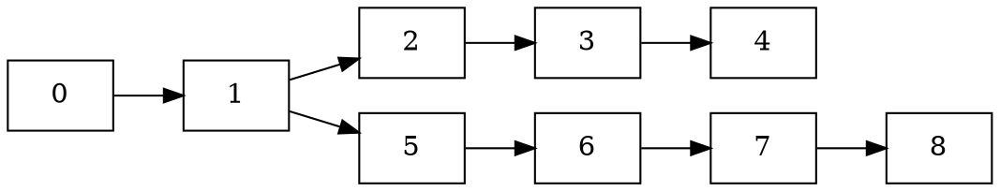
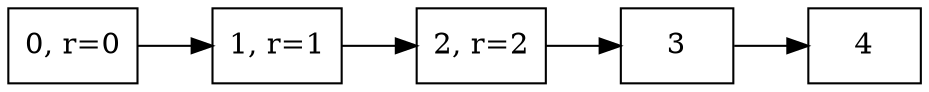
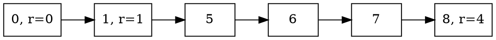

# Example

Consider the set of voters
$$V =\lbrace\text{Alice}, \text{Bob}, \text{Carol}, \text{Dave}\rbrace.$$
Let's assume Alice and Bob are Byzantine voters and manage to partition the
network, dividing the voter set into two
$$V_1 =\lbrace\text{Alice}, \text{Bob}, \text{Carol} \rbrace,$$
$$V_2 =\lbrace\text{Alice}, \text{Bob}, \text{Dave} \rbrace.$$
Since number number of Byzantine voters is above the threshold for BFT safety,
a possible scenario is that they can collude to force finalization on two
different forks,

where $V_1$ finalizes

and $V_2$ finalizes

Note that $V_2$ does not necessarily finalize anything on round 2 and 3.

Lets exemplify this with votes that could lead to this is. First we have the votes before the partition

$$
\text{Round 0}, V:
\begin{cases}
\text{Prevotes} = \lbrace \text{Alice} = 1, \text{Bob} = 1, \text{Carol} = 1, \text{Dave} = 1 \rbrace,\\\\
\text{Precommits} = \lbrace \text{Alice} = 1, \text{Bob} = 1, \text{Carol} = 1, \text{Dave} = 1 \rbrace,
\end{cases}
$$

Then for the first partition, $V_1$,
$$
\text{Round 1}, V_1:
\begin{cases}
\text{Prevotes} = \lbrace \text{Alice} = 4, \text{Bob} = 4, \text{Carol} = 2 \rbrace, \\\\
\text{Precommits} = \lbrace \text{Alice} = 2, \text{Bob} = 2, \text{Carol} = 2 \rbrace,
\end{cases}
$$

and similarly for the second parition $V_2$

$$
\text{Round 1}, V_2:
\begin{cases}
\text{Prevotes} = \lbrace \text{Alice} = 1, \text{Bob} = 1, \text{Dave} = 5 \rbrace, \\\\
\text{Precommits} = \lbrace \text{Alice} = 1, \text{Bob} = 1, \text{Dave} = 1 \rbrace,
\end{cases}
$$

$$
\text{Round 2}, V_2:
\begin{cases}
\text{Prevotes} = \lbrace \text{Alice} = 1, \text{Bob} = 1, \text{Dave} = 5 \rbrace, \\\\
\text{Precommits} = \lbrace \text{Alice} = 1, \text{Bob} = 1, \text{Dave} = 1 \rbrace,
\end{cases}
$$

$$
\text{Round 3}, V_2:
\begin{cases}
\text{Prevotes} = \lbrace \text{Alice} = 8, \text{Bob} = 8, \text{Dave} = 8 \rbrace, \\\\
\text{Precommits} = \lbrace \text{Alice} = 8, \text{Bob} = 8, \text{Dave} = 8 \rbrace,
\end{cases}
$$

Now we have a situation where we sent valid commit messages finalizing blocks on both forks of the chain. Let's now illustrate the steps needed to uncover the equivocating voters.

Step 0: as soon as we detect both commit messages, for block 2 and 8, respectively, we trigger the accountable safety protocol since these are not ancestors of each either, in either direction.

## Step 1

Question to $V_2$:

> Why did the estimate for round 2 in round 3 not include block 2 when prevoting of precommitting?

All three voters in $V_2$ respond with

$$
\text{Round 2, precommits} = \lbrace \text{Alice} = 1, \text{Bob} = 1, \text{Dave} = 1 \rbrace.
$$
This is a valid response since it's impossible to have a supermajority for block 2. For this step it doesn't matter if the reply is the set of prevotes or a set of precommits. Since this response is for the round after the block 2 was finalized in, we move to the next step.

## Step 2

Question to all the precommit voters in the commit for for block 8, which is $V_2$:

> Why did the estimate for round 1 in round 2 not include block 2 when prevoting of precommitting?

All three voters respond with

$$
\text{Round 1, precommits} = \lbrace \text{Alice} = 1, \text{Bob} = 1, \text{Dave} = 1 \rbrace.
$$

At this point we can then take the union between this set of precommits, and the precommits from the commit for block 2, which is
$$
\text{Precommits in commit} = \lbrace \text{Alice} = 2, \text{Bob} = 2, \text{Carol} = 2 \rbrace.
$$
Then we see that Alice and Bob occur twice, and that they equivocated.

Had the reply been in terms of prevotes we would have to proceed to step 3 to conclude the protocol. A valid reply with prevotes could look like

$$
\text{Round 1, prevotes} = \lbrace \text{Alice} = 1, \text{Bob} = 1, \text{Dave} = 5 \rbrace.
$$

## Step 3

Question to all precommit voters in the commit for block 2:

> What prevotes have you seen for round 1?

All three voters respond with

$$
\text{Round 1, prevotes} = \lbrace \text{Alice} = 4, \text{Bob} = 4, \text{Carol} = 2 \rbrace.
$$

Taking the union with this and the reply to the query in step 2 we see that Alice and Bob equivocated.
