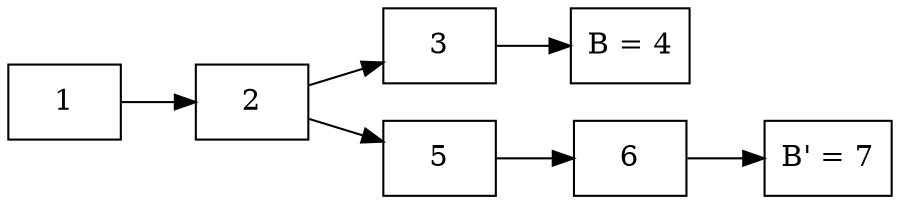

# Outline of the Procedure

With these definitions we can begin outlining the procedure to track down
equivocating voters.

## Step 0.

The first step is detecting blocks B and B' on two different branches being
finalized. If these two blocks were finalized in the same round, we can take
the union of the set of precommits to quickly find the equivocators. So let's
assume that B' was finalized in a later round r' than B, which was finalized in
round r. That is, r'> r.

This occurs when a node detects commit messages for mutually conflicting
blocks. At this point they trigger the accountable safety protocol.

## Step 1. Start asking questions about B'

When we have two blocks that are finalized on conflicting branches, we
naturally ask ourselves, when the latter block was voted for, why wasn't the
former into taken into account? More precisely, when finalizing B' in round r',
why didn't the estimate for the preceeding round include B. Recall that the
estimate for the previous round includes all blocks that could possible be
finalized in that round.

For this step we assume that r' > r + 1, that is, there are at least a two
rounds separation between finalizing B and B'. Should r' = r + 1, we can skip
to step 2 below.

We send out requests to all voters in the commit for B', asking:

> _Why did the estimate for the preceeding round not include B when prevoting
> or precommitting for B'?_

A valid answer is a set S of entirely either of prevotes or precommits for the
preceeding round r'-1, such that it's impossible for S to have a supermajority
for B.

Since the estimate is defined in terms of both prevotes and precommits,
prevotes indirectly through the GHOST function, and precommits directly, we
accept answers containing either of these, but not a mix.

The point of these questions is that we can successively step backwards round
by round until we reach round r+1, which is the round after the first block B
was finalized.

We don't need every voter to reply, as long as we have a single reply
containing the voter set S we can make progress. Only in the case when we get
no replies at all do we consider the non-responders as Byzantine.

We keep sending out requests asking why the estimate in each round didn't
include B, until we get a reply for the estimate of round r+1.

## Step 2. Reach the round after which B was finalized

Once we get a reply containing votes S for the round r+1, we reach a point
where we can start to get closure.

At this point, when we are in round r+1, our request for estimate of the
preceding round will now be be answered with a set of votes that are from the
same round as the first block B was finalized in.

If the reply is in the form of a set S of precommits, we can take the union
with the precommits in the commits message for B to find equivocators. With
this we can terminate the protocol as we've found a set of Byzantine voters.
Not necessarily all of them, but more than the threshold for when Byzantine
consensus can be subverted.

Now if for this step, if the reply to the request is instead a set S of
prevotes, we need to take one additional step before we can home in on the
equivocators.

## Step 3. Instead ask the precommitters for B

To be able to find the equivocators we need something to compare the reply from step 2 against. As such, we send a request to all voters in the commit for block B, asking:

> _What prevotes have you seen for round r?_

A valid reply is a set T of prevotes with a supermajority for B. With this we
can now take the union between T and S to find the equivocators.

